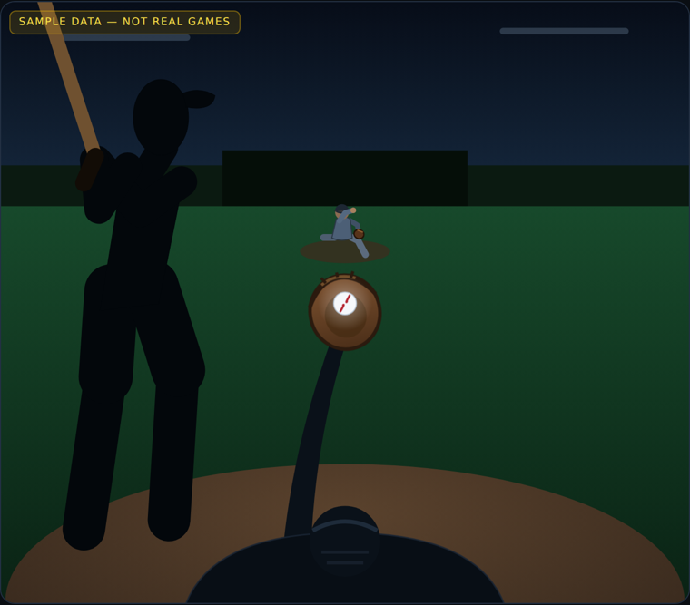
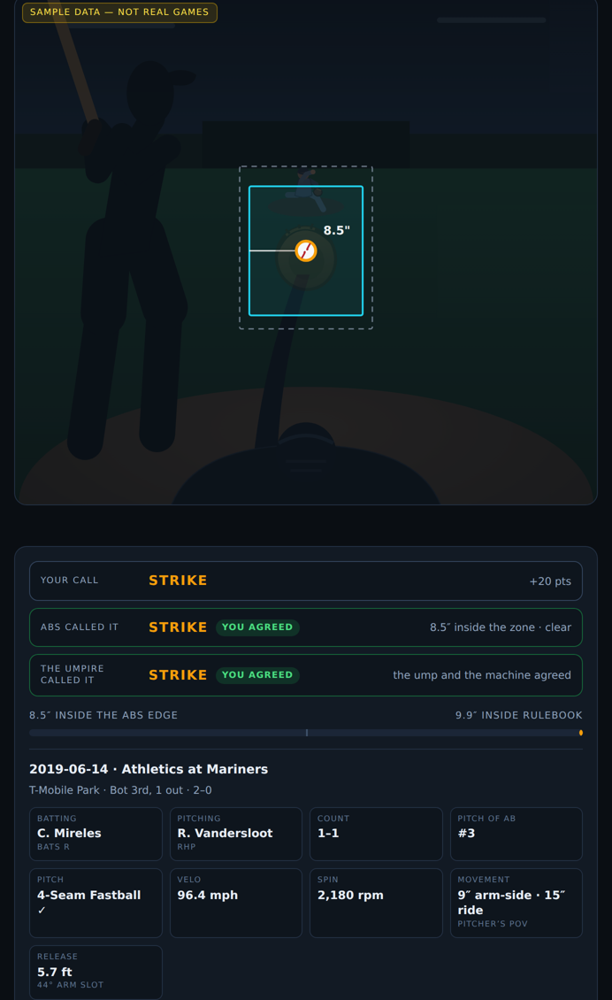

# Balldle

A daily, Wordle-style browser puzzle: ten real pitches from the home-plate umpire's
point of view, and you call each one a ball or a strike. Every call is scored twice —
against the **ABS zone** computed live from the coordinates and the batter's height,
and against the **umpire's actual call** from that game. Where the two disagree, you
find out which side you took.

<p align="center">
  
  
</p>

This is the throwaway prototype stage: one hardcoded round, no backend, no accounts,
no daily rotation. It exists to answer whether *see pitch → call it → find out* is fun
before any of the pipeline machinery gets built.

> **The pitches that ship in `data/pitches.json` are placeholder.** The coordinates are
> physically realistic and every bit of zone math on them is real, but the games,
> players and at-bat outcomes are invented, and the UI says so. `scripts/build_pitches.py`
> replaces them with real Statcast pitches.

## Quick start

```bash
npm install
npm run build      # data/pitches.json + src/index.template.html -> dist/index.html
open dist/index.html
```

`dist/index.html` is fully self-contained — no server, no network, works from `file://`.
`npm run serve` will host it on :8080 if you prefer.

Controls: **Space** throws the pitch, **B** / **S** call it, **R** shows it again,
**Enter** moves on.

## Layout

```
src/index.template.html   the whole game — markup, CSS, and JS in one file,
                          with a single __PITCHES__ placeholder for the data
data/pitches.json         the ten pitches. sample data as committed
scripts/build.mjs         injects data into the template -> dist/index.html
scripts/build_pitches.py  the real pipeline: Statcast -> pitches.json
scripts/gen_sample.py     regenerates the placeholder set
tests/                    geometry, break, release, alignment, full playthrough
docs/DECISIONS.md         why everything is the way it is — read this one
```

The template is deliberately one file. It is a prototype whose job is to be thrown
away or rewritten, and a build step that concatenates modules would be the first thing
to regret.

## Real data

```bash
pip install -r requirements.txt
python3 scripts/build_pitches.py --start 2024-05-01 --end 2024-05-07 --tier medium
npm run build
```

| flag | |
|---|---|
| `--start` / `--end` | date range to pull. 2015-01-01 or later — that is where Statcast tracking begins |
| `--tier` | `easy` 4 borderline / 6 clear · `medium` 6/4 · `hard` 8/2 |
| `--seed` | fix it per calendar day so every player gets the same puzzle |
| `--with-video` | attach a per-pitch `play_id` so each reveal links to that pitch's video |
| `--out` | defaults to `pitches.json` |

What it does: filters to pitches the batter took and the umpire ruled on
(`description` is `called_strike` or `ball` — nothing else has a judgment attached),
drops rows with tracking gaps in `sz_top`/`sz_bot`, measures each pitch's distance
from the ABS boundary, takes the tier's borderline/clear mix with **one pitch per
game** so the ten come from ten different nights, and joins each at-bat's outcome from
the `events` / `des` on that at-bat's final pitch.

Borderline is within 1.5″ of the boundary, clear is 4″ or more, and the mushy middle
is discarded rather than assigned. Both thresholds are constants at the top of the
script and both want tuning against real pitches — the spec called for eyeballing the
split, and nobody has yet.

The script has never run against the live API — it was written where Baseball Savant
was unreachable. Its logic is covered by `tests/test_pipeline.py` against a synthetic
Statcast frame, so expect to fix a column name or two on the first real run.

## The two zones

The game draws both, because the gap between them is the whole point.

- **ABS** (solid cyan) — 17″ wide, top at 53.5% and bottom at 27% of that batter's
  height, read at a single plane in the middle of the plate. This is what the reveal
  scores you against.
- **Rulebook** (dashed grey) — plate width *plus a ball's radius*, with Statcast's
  stance-based top and bottom. Visibly bigger in every direction. This is the zone the
  human behind the plate is actually working.

The batter silhouette is drawn from stance landmarks scaled to his real height and
pinned so the knee hollow lands on the ABS bottom and the shoulder/belt midpoint lands
on the ABS top — the rulebook definition, drawn. A standing figure puts the zone 13
inches too low on the body, which is the trap: ABS's percentages are fractions of
*standing* height but describe the zone as it appears in the batter's *stance*.

## Pitch data schema

Every field is read if present and quietly defaulted if not, so partial data renders.
`REQUIRED` in `scripts/build.mjs` is the short list the build refuses to go without.

| field | |
|---|---|
| `plate_x` `plate_z` | where it crossed, in feet. **The animation never bends these** |
| `sz_top` `sz_bot` | Statcast's stance-based zone for this batter |
| `batter_height_in` | drives the ABS zone and the size of the silhouette |
| `ump_call` | `S` or `B` — what actually happened |
| `release_pos_x` `release_pos_z` | places the pitcher's hand; the arm solves to reach it |
| `release_extension` | sets true flight distance (60.5 − extension) |
| `pfx_x` `pfx_z` | movement in feet; drives the break |
| `release_spin_rate` `spin_axis` | drive the seams |
| `arm_angle` | read and shown; the slot itself comes from release position |
| `vx0 vy0 vz0 ax ay az` | carried, not yet drawn — see roadmap |
| `play_id` `game_pk` | Baseball Savant deep links |

Two knobs at the top of the script: `BREAK_GAIN` (2.2) exaggerates movement for
visibility — set it to 1.0 for true scale — and `SPIN_VIS` (0.13) is the share of real
rpm actually drawn, because 2,300 rpm across a one-second animation is a blur.

## Tests

```bash
npm test                 # builds, then runs all five browser suites
npm run test:pipeline    # the Statcast pipeline against a synthetic frame
```

First run needs `npx playwright install chromium`.

| suite | what it pins down |
|---|---|
| `geometry` | zone math against hand-computed cases, including the same pitch being a ball to a 6'0" batter and a strike to a 6'7" one |
| `break` | sinkers/changeups/fastballs run arm-side, cutters/sliders/curves break glove-side, for both handednesses, and every pitch still lands on its exact coordinates |
| `release` | the ball leaves the hand where the hand is, to 0.000 px |
| `alignment` | zone top on the shoulder/belt midpoint, zone bottom on the knee, measured off the rendered page |
| `playthrough` | ten pitches end to end: scoring, tallies, share card, both replay paths, no console errors, no overflow at 390px |

## Deploying

`.github/workflows/pages.yml` builds and publishes to GitHub Pages on every push to
`main`. Turn Pages on in repo settings with source "GitHub Actions" and it works with
no further setup. `ci.yml` runs the suites on every push and PR.

`.github/workflows/daily-puzzle.yml.example` regenerates the day's pitches from real
Statcast on a cron and commits them. Rename it to switch it on — after reading this:

## Before this is a real daily game

1. **Move the answer key off the client.** `dist/index.html` inlines every pitch and
   its correct call. View-source spoils the puzzle completely. The spec's shape is
   right: a once-daily job writes `easy.json` / `medium.json` / `hard.json` server-side
   and the page fetches them — but that alone doesn't fix it, because the JSON is
   equally readable. Withhold `ump_call` and the coordinates until a pitch has been
   answered, or score on the server.
2. **Tune the borderline threshold** against real pitches instead of the 1.5″ guess.
3. **Decide what "correct" means.** The game currently refuses to — it scores both and
   tells you which side you took. Play it a few times and the answer should be obvious.
4. **Sound.** A called strike with no umpire voice is missing most of its personality,
   and it is the cheapest item on the list.
5. **Swap the parabola for the real trajectory.** `vx0 vy0 vz0 ax ay az` are already
   in the data and describe the actual 9-parameter flight. That is the last big
   fidelity step.

## Naming, licensing, data

The project name is a placeholder — the spec deferred naming deliberately, and it
needs to avoid implying MLB or team affiliation. No logos or likenesses are used
anywhere; the visuals are original stylized SVG.

Statcast data is widely used by the fan-analytics community, but **its terms of use
have not been formally reviewed for this project**. Do that before anything ships
publicly. `LICENSE` covers this repository's own code and is a placeholder choice.
